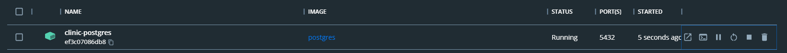

<h1>Clinic-Api</h1>

 

<h2>project's goal</h2> 

Make appointments for a clinic.

<h2>Project Description</h2>

<ul>

<li>I used an API that I produced myself that allows the sending and storage of the queries made by the employees</li>

<li>The method used to produce the project is MVC, facilitating the exchange of information between the database and the user interface.</li>

<li>The project used the PostgreSQL database manager in conjunction with Docker</li>

<li>The project used bcrypt for information integrity, such as the user's password.</li>

<li>The project used JSON Web Token for better control of authorizations and exchange of user information</li>

</ul>

<h2>🤝 Collaborator </h2> 
<table>
  <tr>
    <td align="center">
      <a href="#">
      
       
        
          <b>Diogo Luis</b>
        
      </a>
    </td>
  </tr>
</table>

<h2> 👨‍💻 Technologies </h2>

Technologies used in this project:

 

